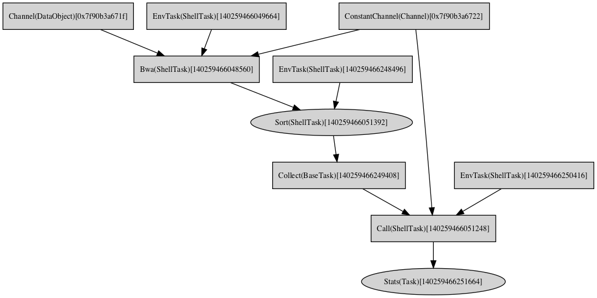
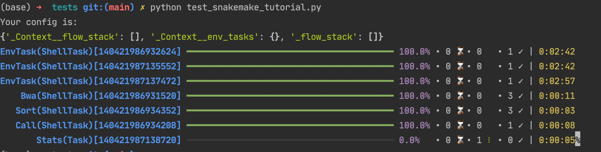

# A dataflow based workflow framework.
### work in progress

- Currently ShellTask only support conda and singularity environment.
- The composing syntax is inspired from nextflow's DSL2.

### Example

- This is a rewrite version of [snakemake tutorial](https://snakemake.readthedocs.io/en/stable/tutorial/short.html)

```python
from pyflow import *

@shell(conda="bwa=0.7.17 samtools=1.9")
def bwa(self, fa: File, fastq: File):
    bam = f"{fastq.stem}.bam"
    Shell(f"bwa mem -t {self.cpu} {fa} {fastq} | samtools view -Sb - > {bam}")
    return bam


@shell(conda="bwa=0.7.17 samtools=1.9")
def sort(bam: File):
    sorted_bam = f"{bam.stem}.sorted.bam"
    Shell(f"samtools sort -o {sorted_bam} {bam}")
    return sorted_bam


@shell(conda="bcftools=1.9 samtools=1.9")
def call(fa: File, bams: list):
    bams = ' '.join(str(bam) for bam in bams)
    Shell(f"samtools mpileup -g -f {fa} {bams} |"
          f"bcftools call -mv - > all.vcf")
    return "*.vcf"


@task
def stats(vcf: File):
    import matplotlib
    matplotlib.use("Agg")
    import matplotlib.pyplot as plt
    from pysam import VariantFile

    quals = [record.qual for record in VariantFile(vcf.open('rb'))]
    plt.hist(quals)

    plt.savefig("report.svg")


@flow
def call_vcf_flow(fa, fastq):
    bams = bwa(fa, fastq) | sort | collect
    call(fa, bams) | stats


prefix = 'snamke-demo.nosync/data'
fa = Channel.value(f'{prefix}/genome.fa')
fastq = Channel.values(*[f'{prefix}/samples/{sample}' 
                         for sample in ['A.fastq', 'B.fastq', 'C.fastq']])

runner, workflow = FlowRunner(call_vcf_flow).run(fa, fastq)
workflow.graph.render('/tmp/workflow', view=True, format='png', cleanup=True)
runner.execute()
```

##### Dag and run output




### Test

```bash
cd tests && python test_snakemake_tutorial.py
```


### Reference
- [nextflow](https://github.com/nextflow-io/nextflow)
- [prefect](https://github.com/PrefectHQ/prefect)